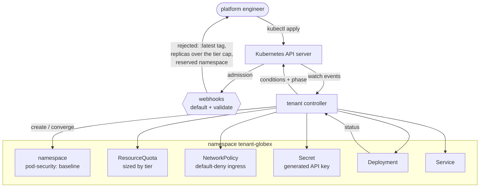

# tenant-operator

[](https://github.com/sahilkalgutkar/tenant-operator/actions/workflows/ci.yml)
[](https://codecov.io/gh/sahilkalgutkar/tenant-operator)
[](codecov.yml)
[](LICENSE)
[](https://go.dev/dl/)

I have deployed onto Kubernetes for years, and every one of my other projects
treats it the same way: as a place to put containers. This one goes the other
direction. I wrote a controller that *extends* the cluster — a custom resource,
a reconcile loop, admission webhooks, finalizers — so that "create a tenant"
becomes a thing the Kubernetes API itself knows how to do.

A `Tenant` here is one customer's slice of a cluster: its own namespace, the
guard rails on that namespace, and the workload running inside it. You write
eleven lines of YAML; the operator provisions a namespace, a resource quota
sized to the tenant's tier, a default-deny network policy, a generated API key,
a Deployment and a Service — and then keeps all of it that way.

```yaml
apiVersion: tenancy.sahilkalgutkar.io/v1alpha1
kind: Tenant
metadata:
  name: globex
spec:
  displayName: Globex Industries
  tier: enterprise
  image: ghcr.io/nginxinc/nginx-unprivileged:1.27-alpine
  replicas: 5
  contactEmail: platform@globex.example
```

```console
$ kubectl get tenants
NAME     DISPLAY NAME        TIER         NAMESPACE       PHASE          READY   DESIRED   AGE
acme     Acme Corporation    free         tenant-acme     Ready          1       1         4m
globex   Globex Industries   enterprise   tenant-globex   Provisioning   3       5         12s
initech  Initech             standard     tenant-initech  Suspended      0       0         1h
```

## Architecture



## How the reconcile loop works

Every pass is written to be safe from any starting state, including halfway
through a previous pass that crashed. There is no step that assumes it is the
one that created what it finds.

1. **Take the finalizer first.** Before anything is created, the Tenant gets a
   finalizer and the update is persisted. A crash between "created a namespace"
   and "recorded that I own it" would otherwise orphan the namespace.
2. **Namespace, then guard rails, then workload — in that order.** If the pods
   came up first there would be a window in which a tenant was running with no
   quota and reachable from every other namespace. The window is small. It is
   also entirely avoidable.
3. **Converge, don't create.** Every object goes through one `apply` helper
   built on `CreateOrUpdate`, so the loop is a series of idempotent "make this
   look like that" steps.
4. **Observe, then report.** The Deployment is read back and its real replica
   count drives the conditions. Without that step a Tenant would report `Ready`
   the moment its Deployment *object* existed, whether or not a pod ever
   started.
5. **On delete, block until the namespace is really gone.** The finalizer is
   only released once the namespace has left the API.

## The decisions worth explaining

**A finalizer, when owner references would already work.** Every object the
operator creates carries an owner reference back to the Tenant, so garbage
collection would eventually delete all of it. But GC is asynchronous and
unordered: the Tenant would vanish from the API while its namespace was still
terminating, and anything scripted around `kubectl delete tenant` would be
racing the teardown. The finalizer makes deletion mean "it is gone", not "it
has been scheduled to go".

**The operator refuses to adopt.** If an object already exists and is not
labelled as this operator's, reconciliation fails loudly instead of taking it
over. Adoption looks convenient right up to the first time an operator
silently rewrites a namespace another team was using — and the teardown path
inherits the same rule, so a tenant pointed at somebody else's namespace will
never delete it.

**The API key is generated exactly once.** Regenerating it every pass would
technically converge, and would also rotate the credential out from under a
running workload every time anything about the tenant changed. Convergence is
not the only property that matters.

**Tiers are a table, not branches.** Replica bounds, CPU and memory, quota
ceilings and delete protection all live in one map. Adding a tier is a table
entry and a test case rather than a new path through the reconcile loop, and an
unknown tier falls back to the *most* restrictive policy — if a tier arrives
that the CRD's enum says is impossible, something is wrong, and the safe
response to a bug is the smallest slice of the cluster rather than the largest.

**The Deployment selector is written once and never touched.** Selectors are
immutable in the API, so anything that can change over a tenant's life must
stay out of them. That is why the tier label is on the pods and the object but
not in the selector: a tier upgrade would otherwise become an update the API
server rejects outright.

**Conditions are the source of truth; the phase is a projection.** `Ready`,
`NamespaceReady` and `WorkloadReady` are what the controller reasons about, and
`status.phase` is derived from them on every write. Two fields that can
disagree about the same fact eventually will.

**A write conflict is not an error.** Losing an optimistic-concurrency race is
the ordinary outcome of a busy workqueue, so it requeues quietly instead of
logging a reconcile error and backing off. An operator whose logs are full of
red for normal behaviour is one nobody reads.

## What the webhooks enforce

The controller applies its own defaults too, so it still converges if the
webhook is unavailable — but admission is where a person finds out they made a
mistake, rather than a condition they have to go looking for.

| Rule | Why |
| --- | --- |
| `spec.image` must carry an explicit tag or digest | A floating `:latest` means the spec no longer describes what is running, and no amount of reconciliation can detect that drift |
| `spec.replicas` may not exceed the tier's ceiling | Silently clamping would run fewer replicas than the manifest says, which nobody notices until an incident |
| `spec.namespace` is immutable | Moving it would orphan everything already created and provision a second, empty copy alongside |
| A tenant name must fit inside a 63-character namespace name | Better rejected at apply time than buried in a condition later |
| `kube-system` and friends are refused | The teardown path deletes the namespace it owns; a typo here would be cluster-ending |
| Enterprise tenants need a confirmation annotation to delete | Deleting a tenant destroys its data, and that deserves a second deliberate action |

It also returns admission *warnings* — no contact address, a suspended tenant,
a single-replica free tier — for the things worth saying out loud but not worth
blocking a rollout over.

## Running it

**Requirements:** Go 1.24+, a Kubernetes cluster (kind is fine), and
[cert-manager](https://cert-manager.io/docs/installation/) if you want the
webhooks, which need a serving certificate the API server trusts.

Install the CRD and run the operator locally against your current kubecontext —
no image build, no cert-manager, webhooks off:

```bash
make install
make run
```

Then create a tenant and watch it come up:

```bash
kubectl apply -f config/samples/tenant_free.yaml
kubectl get tenants -w
kubectl get all -n tenant-acme
```

Deploy it properly, webhooks and all:

```bash
make docker-build IMG=ghcr.io/you/tenant-operator:v0.1.0
make deploy
```

`make render` prints the full install manifest without applying it, if you would
rather read it first. `make undeploy` removes everything it installed.

## Testing

`make test` downloads the envtest control-plane binaries and runs everything
with the race detector. The suite is split deliberately:

- **The control loop runs against a real API server.** envtest starts an actual
  `kube-apiserver` and `etcd`, and the tests drive the real reconciler through
  it: provisioning, drift correction, tier upgrades, suspension and teardown. A
  fake client would happily accept objects a real API server rejects — an owner
  reference from a cluster-scoped Tenant to a namespaced Deployment, a second
  update to a Deployment whose selector I had quietly rewritten — and those are
  exactly the mistakes worth catching.
- **The teardown branches run against a fake client.** A namespace that is
  already gone, or one owned by somebody else, is awkward to arrange on demand
  in a live cluster and trivial to construct in memory.
- **The tier policy, the resource builders and the webhook rules are plain unit
  tests**, because they are plain functions.

envtest runs no kubelet and no deployment controller, so nothing ever becomes
ready on its own. The tests stand in for those controllers explicitly — writing
`status.readyReplicas` onto a Deployment, clearing a namespace's `kubernetes`
finalizer — which keeps it obvious which behaviour is the operator's and which
belongs to the cluster.

Two files are excluded from coverage, both documented in
[`codecov.yml`](codecov.yml): the generated deepcopy functions, and `main()`,
whose logic lives in `internal/bootstrap` precisely so it can be tested.

## Layout

```
api/v1alpha1/        the Tenant type, the tier policy table, the webhooks
internal/controller/ the reconcile loop, the resource builders, status logic
internal/bootstrap/  manager wiring, flag parsing — everything main() would hide
cmd/manager/         the binary
config/              CRD, RBAC, webhook and install manifests (kustomize)
docs/operations.md   flags, RBAC, certificates, and what to check when it breaks
```

## License

[MIT](LICENSE)
